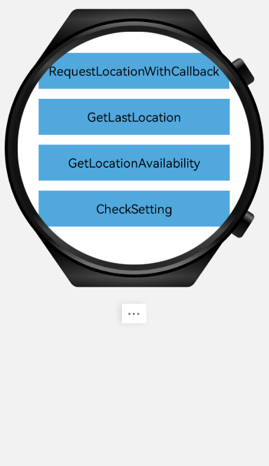
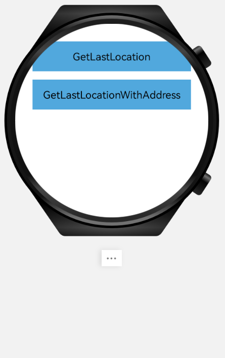
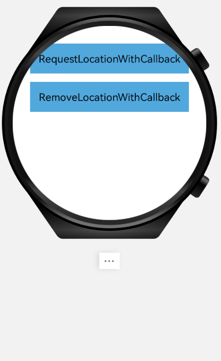

# HMS Core Location Kit Sample for HarmonyOS

English | [中文](README_ZH.md)

## Table of Contents

 * [Introduction](#introduction)
 * [Getting Started](#getting-started)
 * [Installation](#installation)
 * [Supported Environments](#supported-environments)
 * [Sample Code](#sample-code)
 * [Result](#result)
 * [License](#license)

## Introduction
The Huawei location sample code encapsulates the Huawei location API. It provides a number of sample programs for your reference or use.  

## Getting Started
We also provide an example to demonstrate the use of the LocationKit SDK for HarmonyOS.  
This example builds the system using Gradle.  
First, demonstrate by cloning this code repository or downloading a zip package.  
In DevEco Studio, use "Open an existing DevEco Studio project" and select the "harmony-location-demo" directory.  
You can use the "gradlew signReleaseHap" command to build the project directly.  

## Installation
1. Clone or download the project and open the downloaded folder in DevEco Studio.  
2. Use DevEco Studio to install the configured project on the device.  

## Supported Environments
HMS Core (APK) 6.0.0 or later has been installed on the Huawei Smartwatch.  

## Sample Code
1.Invoke requestLocationUpdates of FusedLocationProviderClient to add a location request. Code location in src/main/java/com/huawei/sample/harmony/location/slice/RequestLocationCallbackAbilitySlice.java

## Result

## Technical Support

If you are still evaluating HMS Core, obtain the latest information about HMS Core and share your insights with other developers at [Reddit](https://www.reddit.com/r/HuaweiDevelopers/.).

- To resolve development issues, please go to [Stack Overflow](https://stackoverflow.com/questions/tagged/huawei-mobile-services?tab=Votes). You can ask questions below the huawei-mobile-services tag, and Huawei R&D experts can solve your problem online on a one-to-one basis.
- To join the developer discussion, please visit [Huawei Developer Forum](https://forums.developer.huawei.com/forumPortal/en/forum/hms-core).

If you have problems using the sample code, submit [issues](https://github.com/HMS-Core/hms-location-demo-harmonyos/issues) and [pull requests](https://github.com/HMS-Core/hms-location-demo-harmonyos/pulls) to the repository.

##  License

harmony-location-demo is licensed under the [Apache License, version 2.0](http://www.apache.org/licenses/LICENSE-2.0).
