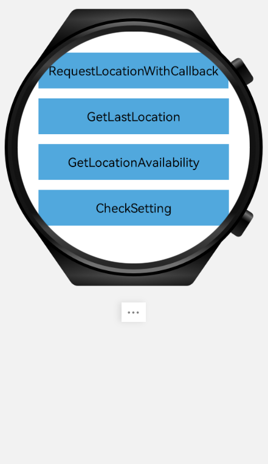

##  华为定位服务鸿蒙示例代码

中文 | [English](README.md)

## 目录

 * [介绍](#介绍)
 * [开始](#开始)
 * [安装](#安装)
 * [支持环境](#支持环境)
 * [样例代码](#样例代码)
 * [结果](#结果)
 * [证书](#证书)

## 介绍
华为定位示例代码封装了华为定位的API。它提供了许多示例程序供您参考或使用。

## 开始
我们还提供了一个示例来演示用于Harmony的LocationKit SDK的使用。
此示例使用Gradle构建系统。
首先，通过克隆此代码仓库或下载压缩包来演示。
在DevEco Studio中，使用“打开现有的DevEco Studio项目”，选择“harmony-location-demo”的目录。
您可以使用“gradlew signReleaseHap”命令直接构建项目。

## 安装

1.克隆或下载此项目，并在DevEco Studio中打开下载的文件夹。  
2.使用DevEco Studio的功能将配置的项目安装到设备上。

## 支持环境
鸿蒙手机已安装HMS Core (APK) 5.3.0及以上版本。

## 样例代码
1. 调用FusedLocationProviderClient的requestLocationUpdates添加定位请求。代码位置在src/main/java/com/huawei/sample/harmony/location/slice/RequestLocationCallbackAbilitySlice.java中

## 结果

## 技术支持

如果您对HMS Core还处于评估阶段，可在[Reddit社区](https://www.reddit.com/r/HuaweiDevelopers/)获取关于HMS Core的最新讯息，并与其他开发者交流见解。

如果您对使用HMS示例代码有疑问，请尝试：

- 开发过程遇到问题上[Stack Overflow](https://stackoverflow.com/questions/tagged/huawei-mobile-services?tab=Votes)，在`huawei-mobile-services`标签下提问，有华为研发专家在线一对一解决您的问题。
- 到[华为开发者论坛](https://developer.huawei.com/consumer/cn/forum/blockdisplay?fid=18) HMS Core板块与其他开发者进行交流。

如果您在尝试示例代码中遇到问题，请向仓库提交[issue](https://github.com/HMS-Core/hms-location-demo-harmonyos/issues)，也欢迎您提交[Pull Request](https://github.com/HMS-Core/hms-location-demo-harmonyos/pulls)。

## 证书

harmony-location-demo is licensed under the [Apache License, version 2.0](http://www.apache.org/licenses/LICENSE-2.0).

